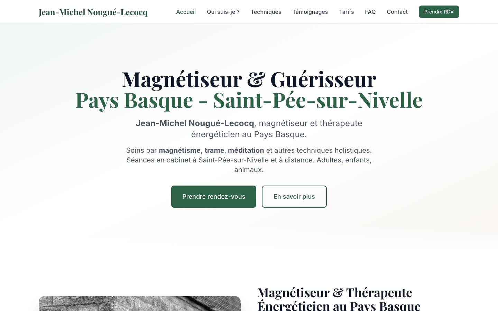

# Magnétiseur Pays Basque

Site vitrine réalisé pour un praticien en magnétisme et soins énergétiques installé
à Saint-Pée-sur-Nivelle (Pyrénées-Atlantiques). Le besoin : une présence en ligne
professionnelle, référencée localement, permettant aux visiteurs de comprendre les
prestations proposées et de prendre contact directement.

<!-- CAPTURE D'ÉCRAN : ajouter ici une image du site (ex: ) -->
<!-- SITE EN LIGNE : ajouter ici le lien vers le site en production -->

## Stack technique

- **Next.js 15** (App Router) et **React 19**
- **TypeScript**
- **Tailwind CSS** pour les styles, **Framer Motion** pour les animations
- **React Hook Form** + **Zod** pour la validation des formulaires
- **Resend** pour l'envoi des emails de contact
- **Google Places API** pour la récupération des avis
- Déploiement **Vercel**

## Fonctionnalités

- Sept pages de contenu éditorial : accueil, présentation du praticien, techniques,
  tarifs, témoignages, FAQ et contact, plus les pages légales.
- Formulaire de contact avec validation côté client et serveur, transmis par email
  via une route API Next.js.
- Affichage des avis Google récupérés dynamiquement via une route API dédiée.
- Optimisation SEO local : métadonnées par page, Open Graph, données structurées
  Schema.org (LocalBusiness) et sitemap.
- Images optimisées automatiquement (formats AVIF/WebP) par le composant Image de Next.js.

## Déploiement

Hébergement sur **Vercel**, déploiement continu depuis la branche `main` du dépôt
GitHub. Les clés d'API et l'adresse de contact sont fournies par les variables
d'environnement Vercel (voir `.env.example` pour la liste attendue).
